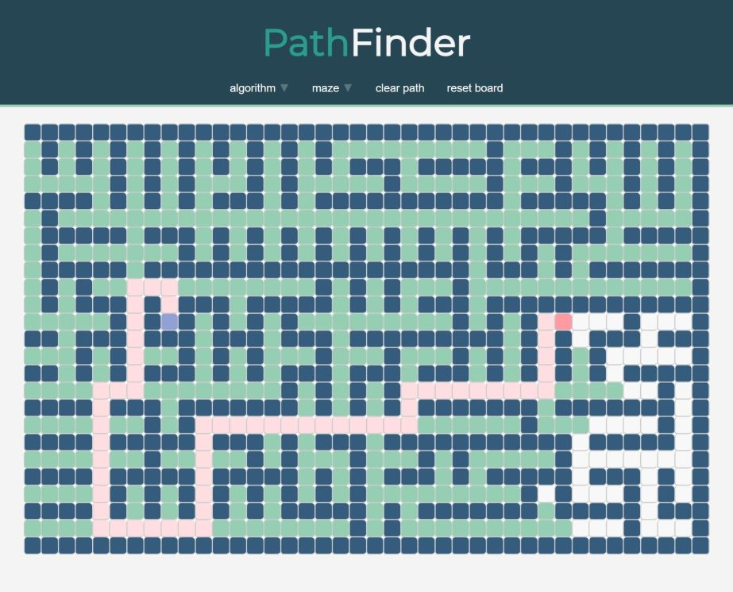

# Pathfinder - Maze Solver and Visualizer
https://carminechoi.github.io/Pathfinder/



Pathfinder is a web based app that allows users to interactively create mazes, solve them using various algorithms, and visualize the process. The application is deployed on GitHub Pages, and it is built using HTML, JavaScript, and CSS.

## Table of Contents

- [Introduction](#introduction)
- [Features](#features)
- [Getting Started](#getting-started)
- [Usage](#usage)
- [Maze Generation](#maze-generation)
- [Solving Algorithms](#solving-algorithms)
- [Contributing](#contributing)
- [License](#license)

## Introduction

The Pathfinder project provides an interactive platform where users can create custom mazes or generate random mazes using Prim's algorithm. Users can then apply solving algorithms like Breadth-First Search (BFS) and Dijkstra's algorithm to find the shortest path from the start to the end of the maze. The visualization helps users understand how these algorithms work and how they navigate through the maze to find the optimal path.

## Features

- Interactive grid-based maze creation.
- Maze generation using Prim's algorithm.
- Visualization of maze-solving algorithms: Breadth-First Search (BFS) and Dijkstra's algorithm.
- Start and end points customization.
- User-friendly and responsive interface.

## Getting Started

To run the project locally, follow these steps:

1. Clone the repository from GitHub:

```bash
git clone https://github.com/carminechoi/Pathfinder.git
```

2. Open the project directory:

```bash
cd Pathfinder
```

3. Open the `index.html` file in your web browser.

Now you should be able to interact with the Pathfinder application locally.

## Usage

1. **Creating a Maze**: You can create a maze by clicking on the grid squares to toggle them between walls and empty spaces. The maze can be customized according to your preferences.

2. **Maze Generation**: To generate a random maze using Prim's algorithm, open the "maze" dropdown and select "PRIM'S". This will create a new maze for you to solve.

3. **Solving the Maze**: Open the "algorithm" dropdown and select your preferred algorithm: Breadth-First Search (BFS) and Dijkstra's. The shortest path will be highlighted once the algorithm reaches the end point.

## License

The Pathfinder project is open-source and is licensed under the [MIT License](LICENSE).

---

Feel free to explore and enjoy the fascinating world of mazes and pathfinding algorithms using Pathfinder! If you have any questions or issues, please don't hesitate to open an issue on the GitHub repository. Happy solving! 🚀
